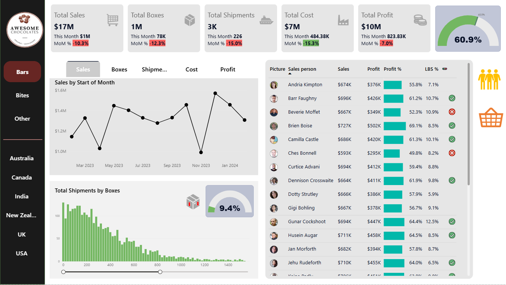

# 🍫 Awesome Chocolates – Power BI Analytics

 

This repository contains the **raw dataset**, **DAX measures**, **ER diagram**, and **Power BI dashboard** used to analyze sales, shipments, and profitability across products, salespeople, and regions

---

## 📂 Project Files

Awesome Chocolates - Data_Raw.xlsx → Raw dataset

Awesome_Chocolates.pbix → Power BI dashboard file

Dashboard_Preview.png → Preview image of the dashboard

DAX_measures.md → Documentation of DAX measures used

Data_Dictionary.md → Explanation of dataset fields

ER_Diagram.md → Entity-Relationship diagram

README.md → Project overview (this file)

---

## 📘 Dataset Overview

The dataset follows a **star schema** with one fact table and multiple dimension tables.

### Tables
- **Shipments_Fact** → Sales transactions (sales, cost, boxes, shipments)
- **Products_Dim** → Product details (category, cost per box)
- **People_Dim** → Salespeople & teams
- **Locations_Dim** → Geography & region
- **Calendar_Dim** → Date hierarchy

👉 Full **data dictionary**: [Data Dictionary](Data_Dictionary.md)
👉 ER Diagram: [ER Diagram](ER_Diagram.png)

---

## 📊 Dashboard Preview

The dashboard provides:
- **Core KPIs** → Sales, Shipments, Boxes, Cost, Profit, Profit %  
- **MoM Analysis** → Growth/decline trends  
- **Regional Insights** → Sales and profit by geography  
- **Product Performance** → Contribution by category  
- **Salesperson Analysis** → Revenue and profitability by team/person  
- **Shipment Efficiency** → Low Box Shipments (LBS) %  

👉 Full interactive dashboard: [Awesome_Chocolates.pbix](Awesome_Chocolates_Dashboard.pbix)

---

## 📈 DAX Measures

Key calculations used in the dashboard include:

- **Core Metrics** → Total Sales, Shipments, Boxes, Profit, Profit %  
- **Previous Month Metrics** → Enables MoM comparisons  
- **MoM % Change** → Growth rates across KPIs  
- **Latest Month Metrics** → Snapshot of current performance  
- **Targets & Indicators** → Profitability benchmarks  
- **Parameter Measure** → Dynamic measure selection for visuals  

👉 Full list with documentation: [DAX measures.md](DAX_measures_doc.md)

---

## 💡 Business Questions Answered

This analytics project helps answer:

1. What are the **total sales, profit, and shipments** this month vs. previous months?  
2. How is the **Month-on-Month growth** across key metrics?  
3. Which **products and categories** are driving sales and profitability?  
4. Who are the **top-performing salespeople**?  
5. What percentage of shipments are **low-volume (LBS < 50 boxes)**?  
6. How do **regions compare** in terms of revenue and profit contribution?  
7. Are we meeting the **profit margin target (60%)** consistently?  
8. What are the **seasonal sales trends** across the timeline?  

---